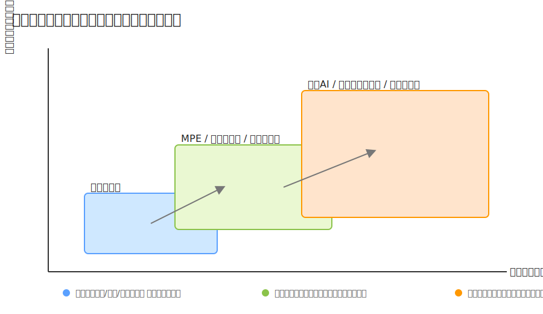
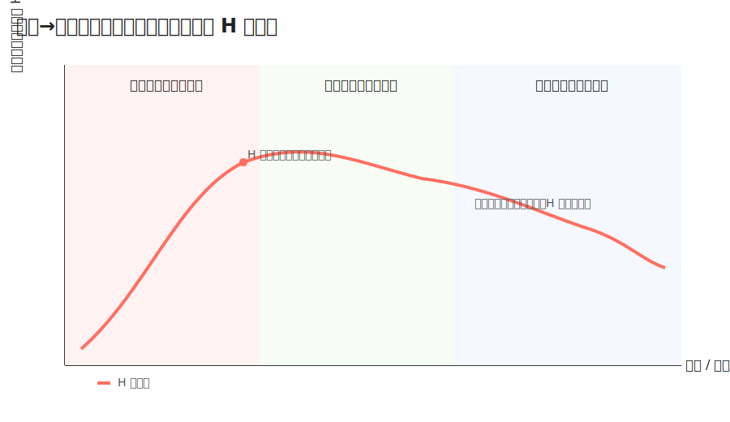

# MELモデルで音楽を捉え直す — 情報エントロピーと創造の循環

- MELモデルを使い
- 新しい表現を生み出し
- 人類の美的感覚のアップデートを行う
- 音楽の概念拡張（概念進化）／楽器の表現拡張（テクノロジー進化）／音楽の表現拡張（文化進化）

---

## 目次
- 0. 音楽とは何か？
- 0-0. 導入
- 0-1. 進化する「音楽」概念
- 0-2. MELモデルが推し進める音楽進化
- 1. MELモデルとは何か？—音楽の循環構造
- 1-1. 音楽のライフサイクル
- 1-2. MELモデルの6つの要素
- 1-4. 循環する創造性
- 2. MELモデルから見えること
- 2-1. MELモデルを循環させる原動力—過剰模倣
- 2-2. 情報エントロピーの増大—探索空間と収束設計

---

## 0. 音楽とは何か？

音楽は音そのものではなく、「人間—インターフェース—情報」の翻訳と循環で立ち上がる経験である。意味は、演奏者の意図と聴衆の期待が交差する地点で都度再構築され、文化文脈によって機能と解釈が更新される。したがって本質は固定属性ではなく、関係性のダイナミクスに宿る。

実務TIP: 作品を「音」だけでなく「情報（構造・記号・文脈）」としても管理する。

## 0-0. 導入

本稿はMEL（Music Evolution Loop）モデルを用い、創作と鑑賞の往還を“設計可能なループ”として捉え直す。新しい楽器やアルゴリズムは表現の探索空間を広げ、分布の不確実性＝情報エントロピーを高めるが、制約と編集、公開設計次第でそれは新しい美へ収束しうる。目的は、このループを意識的に動かし「美的感覚のアップデート」を現実化することにある。

## 0-1. 進化する「音楽」概念

20世紀以降、実験音楽・電子音楽・民族音楽研究、ケージの「4'33''」などにより、「音楽」の境界は拡張してきた。記譜・録音・ネットワーク・AIの発展は、音楽を「音の並び」から「情報の取り扱い」へと焦点移動させた。波形・記号・ジャンル・身体所作など異なる抽象度は相互変換されうる“多相データ”であり、文脈が変われば意味も機能も変わる。概念進化とは、この翻訳可能性の範囲とルールを拡げる営みである。

## 0-2. MELモデルが推し進める音楽進化

MELは、作る／記録する／再生する／鑑賞するの循環を、翻訳点（エンコード/デコード）の連鎖として可視化する。新規の翻訳点—MPE鍵盤、確率シーケンサ、条件付き生成AIなど—は探索次元を追加し、作り手と受け手の選択分布を平坦化させる（エントロピー上昇）。その発散を、制約・編集・配布設計で意味へと収束させることが、モデル運用の核心だ。

---

## 1. MELモデルとは何か？—音楽の循環構造

MELは「人間（作曲者/鑑賞者）—インターフェース（楽器/メディア）—情報（音情報体）」の三層が翻訳を介して閉じないループを形成する見取り図である。要は、音楽は“流れる情報”をどう掴み、どう返すかの設計問題である、という視点だ。

## 1-1. 音楽のライフサイクル

作曲→記録→再生→鑑賞→フィードバックという旅路は、各段で情報の表現形式が変わる。作曲では意図が構造へ、記録では構造が媒体へ、再生では媒体が音圧場へ、鑑賞では音が意味へと変換される。系を開くほど（データ公開、二次創作、ライブ、API連携）入力源が多様化し分布は拡散＝エントロピーは増大する。拡散は創造の燃料であり、同時に編集設計を要求する負債でもある。

実務TIP: 「発散→収束→固定」の3フェーズを必ず設け、評価指標（A/B、保存率、リミックス数）を前段で決める。

## 1-2. MELモデルの6つの要素

- 作曲者: 意図と選好を持つモデル。
- 楽器: 身体信号と音情報体を結ぶ変換器。
- 音情報体: 波形〜記号〜メタまでを内包する多相データ。
- 記録メディア: 情報を保持する器（ファイル/記憶/譜面）。
- 再生メディア: 情報を音として再立ち上げる装置/空間。
- 鑑賞者: 予期と評価で分布を更新し、次の創作へ還流させる主体。

各要素は翻訳点であり、品質（S/N、分解能、表現次元）が上がるほど探索空間は拡張しエントロピーは上昇する。

## 1-4. 循環する創造性

創作は「発散（生成・探索）」と「収束（選択・編集）」の交互運動で進む。新しい楽器やアルゴリズムは発散を加速するが、収束の設計—制約（キー/テンポ/フォーム）、混合戦略（確率生成＋手編集）、評価ループ（A/B・プレイリスト反応）—が意図の輪郭を取り戻す。良い運用とは「意図を保ったままエントロピーを操る」ことに他ならない。

実務TIP: 制約は“早く”かける。プリセット→確率生成→手編集の順で“粗→細”へ。

---

## 2. MELモデルから見えること

概念進化・テクノロジー進化・文化進化は同一ループの別相である。概念が拡がるとツール要件が変わり、ツールが次元を増やすと文化側の選好分布が変わる。文化が開くと（ライセンス/コミュニティ/流通）系の入力が増え、再び概念が更新される。ここで鍵となるのが情報エントロピーで、発散を恐れずに増やし、収束で意味化する「二相運転」が進化速度を決める。

## 2-1. MELモデルを循環させる原動力—過剰模倣

人は効率より規則性全体をなぞる（過剰模倣）。この“無駄”は、誇張や失敗を通じて新しい特徴量を露出させ、スタイルを結晶化させる。模倣が多いほど表現分布は一時的に平坦化（エントロピー上昇）し、その後コミュニティの選好でピークが立つ（収束）。公開・再利用・派生を促進する設計は、この相転移を加速させる実務である。

実務TIP: ステム配布・リミックス募集・明確なライセンスで「模倣しやすさ」を設計する。

## 2-2. 情報エントロピーの増大—探索空間と収束設計

新しい楽器＝新しいインターフェース/アルゴリズム/データは、表現の探索空間を拡張し、選択の不確実性（情報エントロピー）を増大させる。これは混沌ではなく、発見の余地である。

- 何が“増える”のか: 音色パラメータ、時間分解能、ダイナミクス、同時発音、調律体系、確率制御、外部データ接続。

<!-- 図版: 探索空間の拡張 -->
<figure>
  
  <figcaption>図1. 探索空間の拡張: MPE/モジュラー/サンプラー、生成AIで表現次元が増え、到達可能状態集合が広がる。</figcaption>
  
</figure>

<!-- 表: 次元の内訳 -->
<table>
  <thead>
    <tr>
      <th>増える次元</th>
      <th>代表例</th>
      <th>表現への効果</th>
    </tr>
  </thead>
  <tbody>
    <tr>
      <td>音色パラメータ</td>
      <td>モジュラー/シンセの複合変調</td>
      <td>微細な質感差・音像の多様化</td>
    </tr>
    <tr>
      <td>時間分解能/編集</td>
      <td>サンプラー/DAW/タイムストレッチ</td>
      <td>マイクロタイミング/引用の自由度</td>
    </tr>
    <tr>
      <td>ダイナミクス/ジェスチャ</td>
      <td>MPE/オシレーターFM/物理モデリング</td>
      <td>連続的コントロール/身体性の増幅</td>
    </tr>
    <tr>
      <td>確率/生成制御</td>
      <td>確率シーケンサ/条件付き生成AI</td>
      <td>探索の自動化/偶発性の導入</td>
    </tr>
    <tr>
      <td>外部データ接続</td>
      <td>センサ/ウェブAPI/コーパス学習</td>
      <td>文脈同期/潜在空間の拡張</td>
    </tr>
  </tbody>
  
</table>

<!-- 図版: 発散→収束カーブ（Hの推移） -->
<figure>
  
  <figcaption>図2. 情報エントロピー H の推移: 発散でHが増大し、編集で意味へ収束して適切に低下・安定する。</figcaption>
</figure>
- 歴史スナップ: ピアノ（ダイナミクス×和声）、エレキ＋FX（サステイン×非線形）、シンセ/モジュラー（音色次元×変調）、サンプラー/DAW（時間編集×引用可能性）、ボカロ/AI音声（声質合成×テキスト制御）、生成AI（潜在空間×確率探索）。
- 運用原則: 発散（生成）→収束（選択・編集）→固定（配布）。意図を保つ制約を前段に置き、評価ループで分布を締める。

実務TIP: 1作品を多相データで保持（WAV/MIDI/コード/構造）。“生成→選好テスト→手編集”の3点を1サイクルにする。

---

### まとめ / 次の一歩

- 音楽は翻訳と循環で進化する。MELはその設計図である。
- 新しい楽器は探索空間を拡張し、情報エントロピーを上げる。良い制作は、そのエントロピーを操り意図へ収束させる運転にある。
- 次回は「情報の楽器化」「開いた系としての運用」へ。リポジトリやアプリで実装例を共有する。

著者: 新村彰啓 / iOS録音アプリ Pickout 開発
